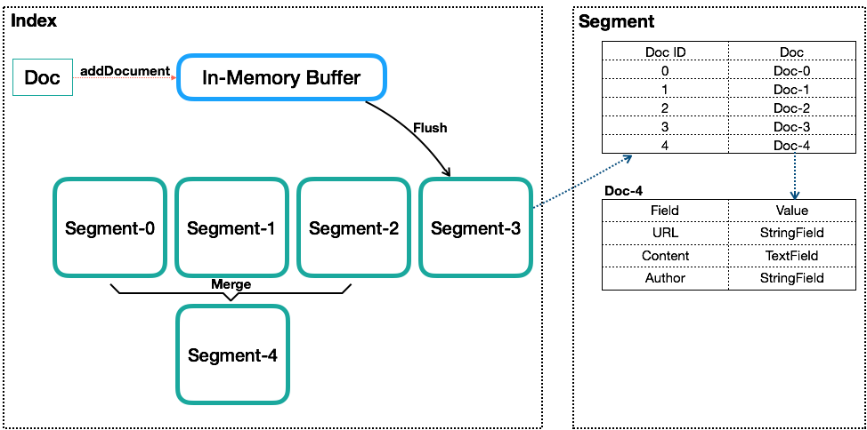
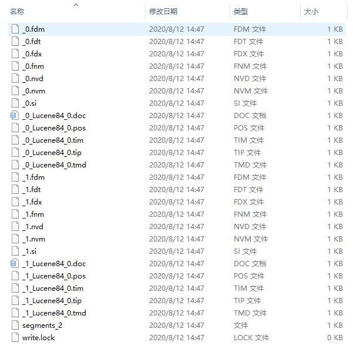

# Lucene 源码解析
索引(index)，段(segment)，文档(document)，域(field)，词项(term)是Lucene的基本概念。

* 一个索引包含一系列的segment(可以完整提供搜索服务的单位)组成
* 一个段由一系列的document组成
* 一个文档由一系列的field组成
* 一个域是被命名的一系列term组成
* 一个词项是由一系列的字节组成，词项是倒排索引的基本单位

## index索引完整的文件
lucene索引文件如下图

 

| 文件名称 | 文件后缀 | 文件内容 |
| :------| :------ | :------ |
| Segments File | segments_N | 保存提交点的信息|
| Lock File	 | write.lock | 写文件锁，用于防止多个IndexWriters同时写一个文件 |
| Segment Info	 | .si	 | 保存段的元数据信息 |
| Compound File  | .cfs, .cfe | 采用混合格式下该文件包括其他所有格式的文件 |
| Fields		 | .fnm	 | 保存域信息 |
| Field Index	 | .fdx	 | 保存指向域数据的指针 |
| Field Data	 | .fdt | 保存域数据 |
| Term Dictionary | .tim	 | 保存词项信息 |
| Term Index | .tip	 | Term Dictionary的索引信息 |
| Frequencies	 | .doc	 | 记录文档信息，以及文档中词项对应的词频 |
|Positions|.pos	|记录词项的位置信息|
|Payloads 荷载因子|.pay	|全文索引的字段，使用了一些像payloads的高级特性会有该文件，保存了term在doc中的一些高级特性|
|Norms|.nvd, .nvm|文件保存索引字段加权数据|
|Per-Document Values |.dvd, .dvm|lucene的docvalues文件，即数据的列式存储，用作聚合和排序
|Term Vector Index	|.tvx	|索引"该文档->该文档的域在tvd文件中的偏移"以及"该文档->该文档第0个域在tvf文件中的偏移|
||||
 

## 索引文件解析
Segment Info：记录段的元数据信息，比如文档数量，用到了哪些文件
* [segment文件结构](doc/indexformat/segment.md)  

